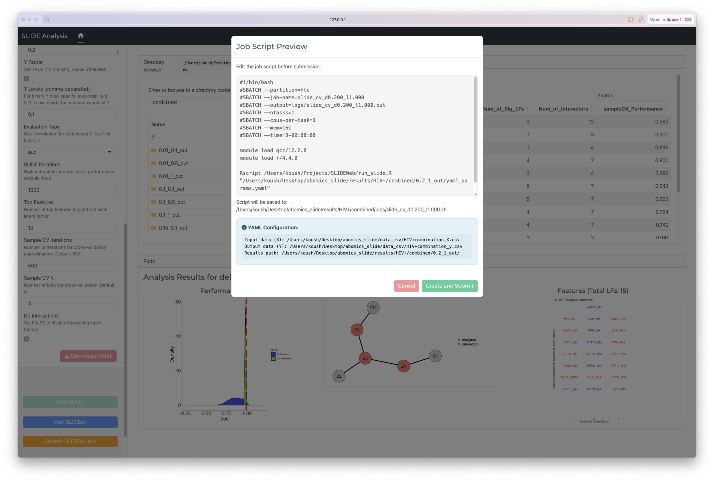

# SLIDEWeb
Shiny WebApp for SLIDE



## Setup on CRC clusters
git clone https://github.com/Koushul/SLIDEWeb.git

module load gcc/10.2.0 r/4.2.0

## Then install all dependencies

To install the required R packages, start R and run the following commands:

```R
install.packages(c(
  "shiny",
  "bslib",
  "shinyjs",
  "yaml",
  "DT",
  "plotly",
  "rmarkdown",
  "dplyr"
  "devtools"
))

devtools::install_github("jishnu-lab/SLIDE")
```

# Select `R Shiny` under Interactive Apps on ondemand
Make sure to set the App Directory path to the folder where the app.R is